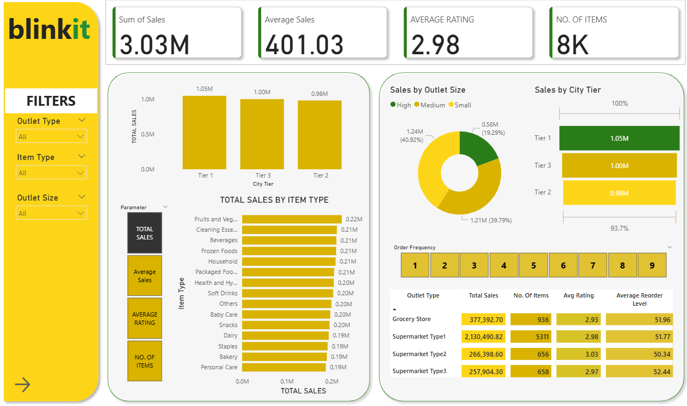
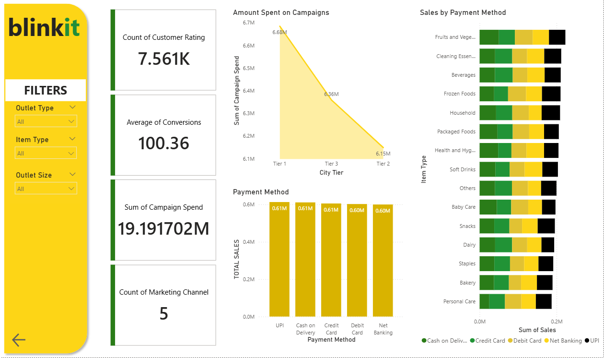

# Blinkit_Dashobard
# 🛒 Blinkit Retail Insights: Sales & Marketing Dashboard

An interactive Power BI dashboard that delivers deep insights into sales trends, customer behavior, campaign performance, and item-level analysis for Blinkit’s retail outlets across different city tiers and outlet types.

---

## 📌 Purpose

This dashboard aims to help retail stakeholders track item sales, outlet performance, marketing ROI, and customer satisfaction across multiple dimensions such as city tier, outlet size, and payment method.

---

## ⚙️ Tech Stack

The dashboard was developed using:

- 📊 **Power BI Desktop** – For building interactive reports and dashboard layout  
- 🧹 **Power Query** – To clean and structure sales, rating, and campaign data  
- 📈 **DAX (Data Analysis Expressions)** – For creating custom KPIs and calculations  
- 🗂️ **File Format** – `.pbix` for Power BI report development and `.png` for visuals

---

## 📁 Data Source

**Source**: Self-generated mock dataset created for educational and portfolio purposes.

The dataset simulates Blinkit's operations and includes variables such as:

- Item sales volumes and categories  
- Outlet types, sizes, and city tiers  
- Payment methods (UPI, Card, Cash, etc.)  
- Customer ratings (scale of 1 to 5)  
- Campaign spending and marketing conversions  
- Reorder levels and average sales metrics

---

## 🌟 Features / Highlights

### 🔹 Business Problem

Blinkit aims to analyze item-level sales, outlet performance, and marketing effectiveness while gaining insights into customer satisfaction to inform better decision-making.

### 🔹 Dashboard Objectives

- Analyze total sales by city tier, outlet size, and item type  
- Evaluate customer feedback using average ratings and reorder levels  
- Track marketing campaign spend and conversion rates  
- Understand trends in payment methods  
- Enable dynamic filtering and drilldowns for detailed insights

---

## 🖼️ Screenshots

### 📊 Page 1: Sales Overview & Outlet Performance  

### 💰 Page 2: Campaign Analytics & Payment Insights  

